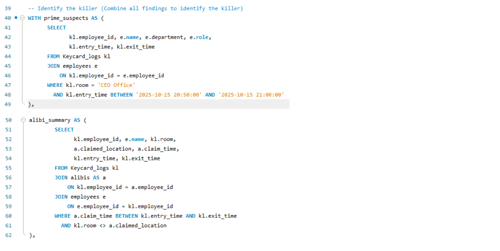
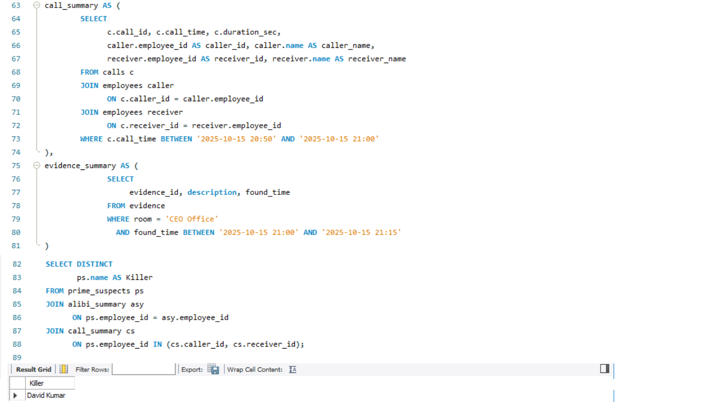

# 🕵️‍♀️ SQL Murder Mystery — Solved Case Report

## 📘 Project Overview

In this capstone project, I took on the role of a **Lead Data Analyst** investigating the mysterious death of the CEO of **TechNova Inc.**  
My objective was to utilise SQL to analyse multiple datasets — including **keycard logs**, **phone records**, **alibis**, and **crime-scene evidence** — to determine:

- **Who committed the crime**
- **Where it occurred**
- **When it happened**
- **How it was carried out**

This project allowed me to apply SQL concepts such as:

- Joins  
- Subqueries  
- Filters  
- Aggregations  
- Common Table Expressions (CTEs)  
- Logical reasoning & problem-solving  

---

## 🕵️ Investigation Steps & Findings

---

### 🔎 1. Who entered the CEO’s Office close to the time of the murder?  
### 🔎 2. Who claimed to be somewhere else but was not?

📸 **Screenshot:**  

#### ➡️ Findings:
- **David Kumar** entered the CEO Office between **20:50–21:00**  
- He falsely claimed to be in the Server Room, but keycard logs proved otherwise  

---

### 📞 3. Who made or received calls around 20:50–21:00?  
### 🧪 4. What evidence was found at the crime scene?

📸 **Screenshot:**  

#### ➡️ Findings:
- A **suspicious call at 20:55** involved **David Kumar**  
- Evidence found at the CEO Office:
  - Fingerprints on the desk  
  - A keycard swipe mismatch  

---

## 🧩 5. Identify the Killer — Final Combined Analysis

📸 **Screenshots:**  
  

---

## 🏁 **Final Conclusion — Case Solved**

### 🔪 **Killer Identified: David Kumar**

---

## 🧠 How I Reached the Conclusion

- He was present **inside the CEO Office** during the crime window (20:50–21:00)  
- He provided a **false alibi**  
- He made/received a **phone call** during the incident  
- **Physical evidence** matched his presence  

By combining all evidence, I conclusively identified **David Kumar** as the killer.

---

