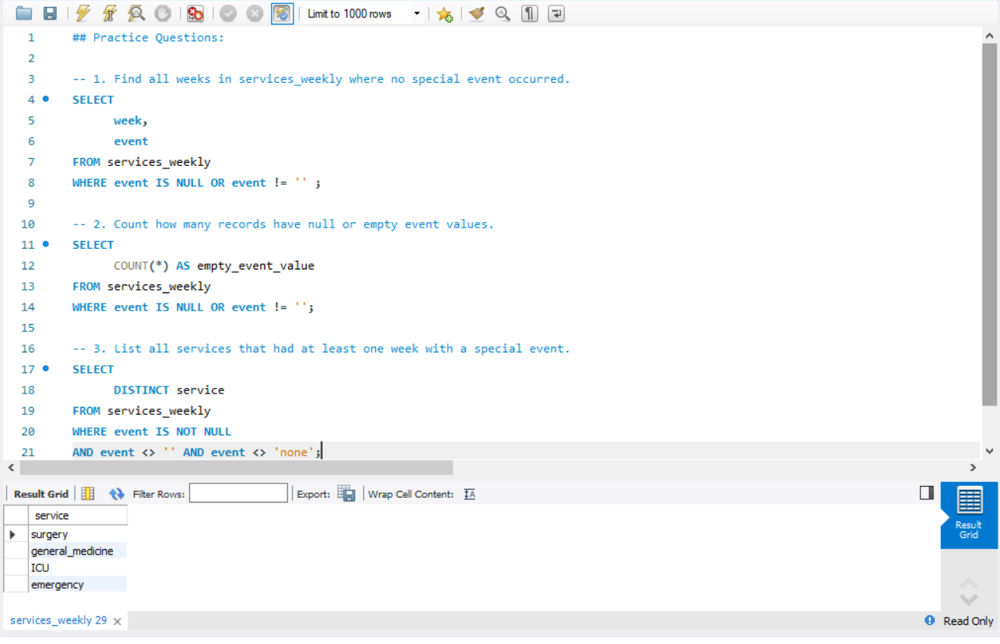
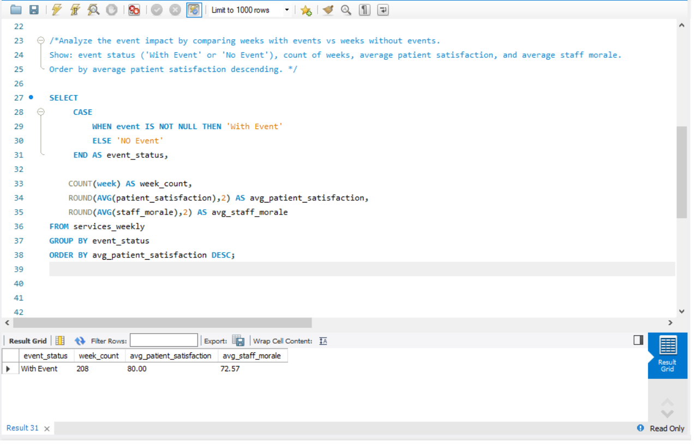

# 📅 Day 12: NULL Values & IS NULL / IS NOT NULL

## 📘 Topics Covered
- NULL values  
- IS NULL / IS NOT NULL  
- Handling empty or missing fields  
- Basic cleaning logic  

---

## 📝 Practice Questions

1. Find all weeks in `services_weekly` where no special event occurred.  
2. Count how many records have NULL or empty event values.  
3. List all services that had at least one week with a special event.

📸 **Practice Questions Screenshot:**  

---

## ⭐ Daily Challenge

**Question:**  
Analyze the event impact by comparing weeks with events vs weeks without events.  
Show:  
- Event status (`With Event` or `No Event`)  
- Count of weeks  
- Average patient satisfaction  
- Average staff morale  

Order by **average patient satisfaction descending**.

📸 **Daily Challenge Screenshot:**  

