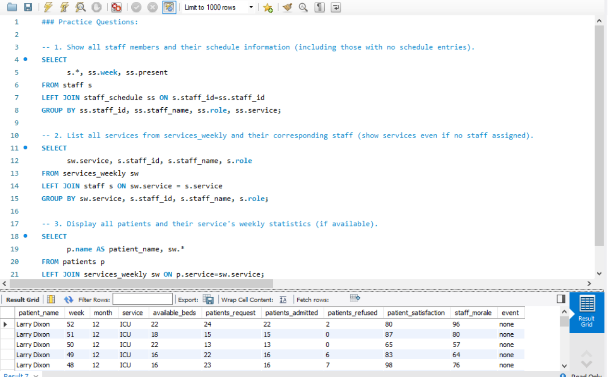
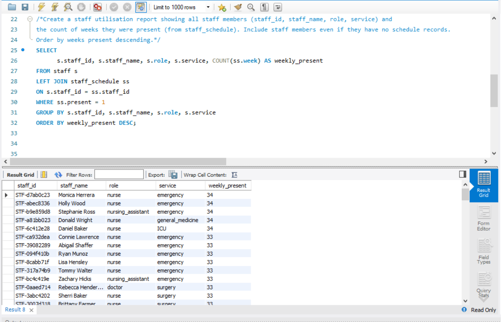

# 📅 Day 14 : LEFT JOIN & RIGHT JOIN  

**🔍 Topics:** LEFT JOIN, RIGHT JOIN, handling unmatched records  
**🗄 Database:** hospital  

---

## 📝 Practice Questions

1. Show all staff members and their schedule information (including those with no schedule entries).  
2. List all services from `services_weekly` and their corresponding staff (show services even if no staff assigned).  
3. Display all patients and their service's weekly statistics (if available).  

**📸 Practice Questions Screenshot:**  

---

## ⭐ Daily Challenge  

**🧩 Question:**  
Create a staff utilisation report showing all staff members (**staff_id, staff_name, role, service**) and the count of weeks they were present (from `staff_schedule`). Include staff members even if they have no schedule records.  
Order by **weeks present descending**.

**📸 Daily Challenge Screenshot:**  

