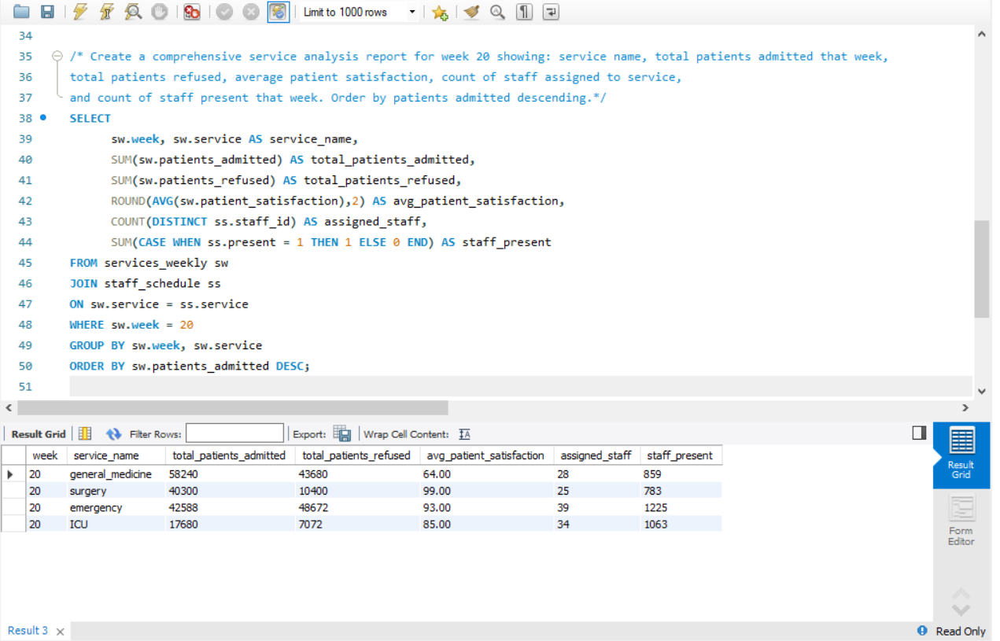

# 📅 Day 15 — Multiple Joins

**🗄 Database:** `hospital`  
**🧠 Topics Covered:** Multiple Joins, Complex Relationships

---

## 🧩 Practice Questions

1. Join patients, staff, and staff_schedule to show patient service and staff availability.  
2. Combine services_weekly with staff and staff_schedule for comprehensive service analysis.  
3. Create a multi-table report showing patient admissions with staff information.

### 📸 Practice Questions Screenshots:
.png)  
.png)

---

## 🚀 Daily Challenge

### 📝 Challenge Question:
Create a comprehensive service analysis report for **week 20** showing:  
- Service name  
- Total patients admitted  
- Total patients refused  
- Average patient satisfaction  
- Count of staff assigned to service  
- Count of staff present that week  

📌 Order by **patients admitted descending**.

### 📸 Daily Challenge Screenshot:

---
