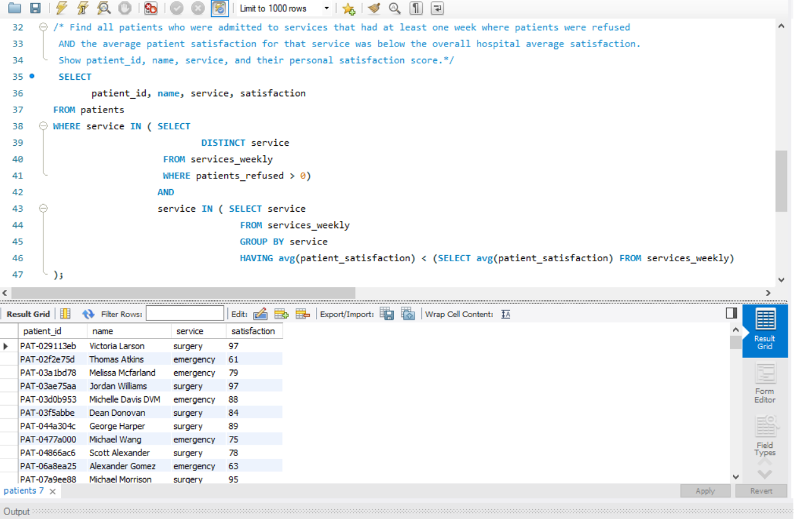

# 🌟 Day 16: Subqueries (WHERE Clause)

**📌 Database:** hospital  
**📘 Topics Covered:** Subqueries in `WHERE`, nested queries, filtering with subqueries

---

## 📝 Practice Questions

1. Find patients who are in services with above-average staff count.  
2. List staff who work in services that had any week with patient satisfaction below 70.  
3. Show patients from services where total admitted patients exceed 1000.  

### 📸 Practice Questions Screenshots  
- **Practice Q1 & Q2 Screenshot:**  
  .png)

- **Practice Q3 Screenshot:**  
  .png)

---

## 🚀 Daily Challenge

**🔍 Question:**  
Find all patients who were admitted to services that had **at least one week with refused patients** AND the **average patient satisfaction of that service is below the overall hospital average satisfaction**.  
Show:  
- patient_id  
- patient name  
- service  
- personal satisfaction score  

### 📸 Daily Challenge Screenshot  

---

