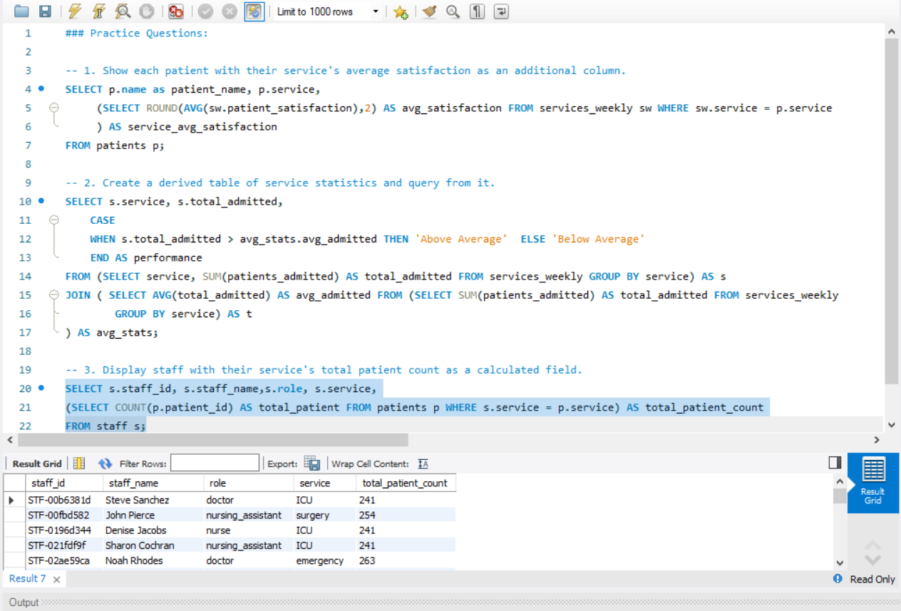
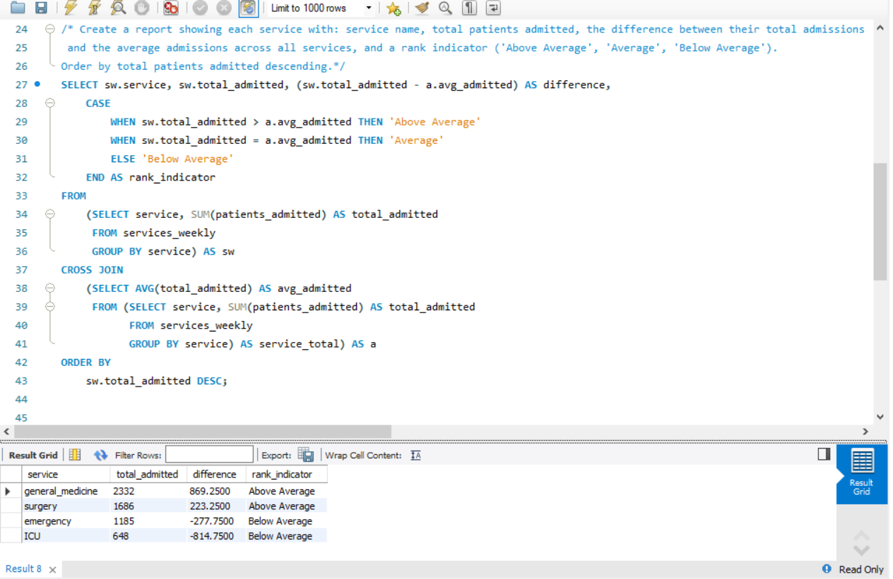

# 📅 Day 17 : Subqueries in SELECT & FROM Clause  

**📚 Topics Covered:**  
Subqueries in SELECT, derived tables, inline views  

**🗂 Database:** **hospital**

---

## 📝 Practice Questions

1. Show each patient with their service's average satisfaction as an additional column.  
2. Create a derived table of service statistics and query from it.  
3. Display staff with their service's total patient count as a calculated field.  

### 🖼 Practice Questions Screenshot  

---

## ⭐ Daily Challenge

**🔍 Question:**  
Create a report showing each service with:  
- service name  
- total patients admitted  
- the difference between their total admissions and the average admissions across all services  
- a rank indicator (**'Above Average'**, **'Average'**, **'Below Average'**)  

➡️ Order the results by **total patients admitted descending**.

### 🖼 Daily Challenge Screenshot  

---
