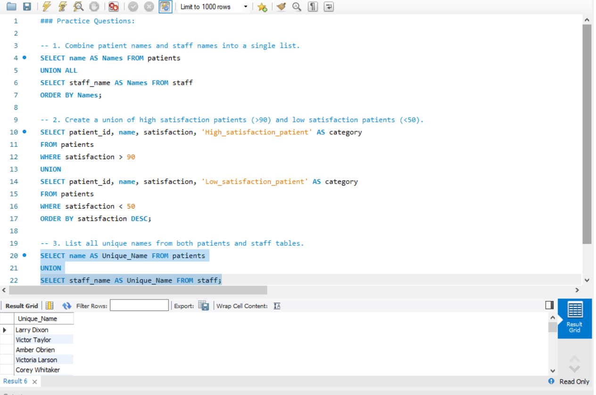
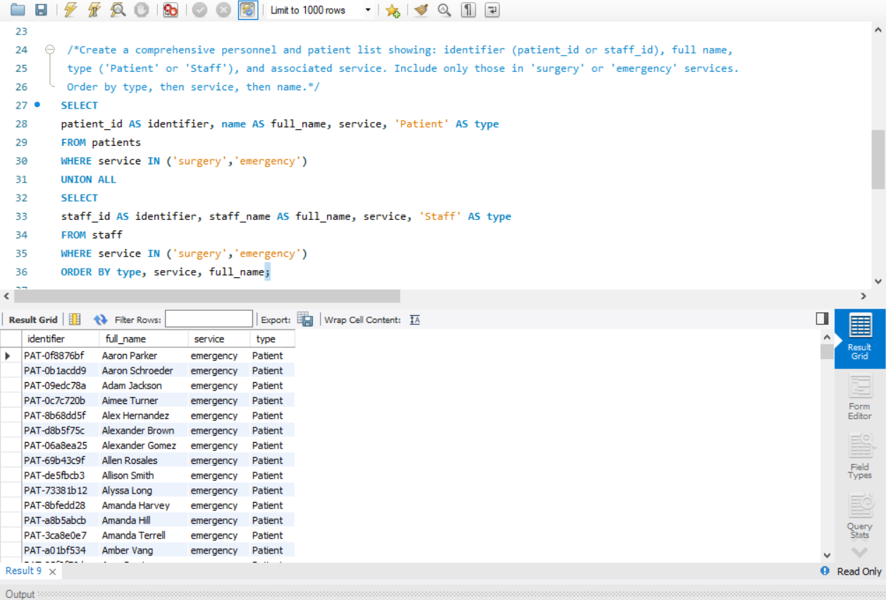

# 📅 Day 18 : UNION & UNION ALL

**📚 Topics Covered:**  
Combining result sets using **UNION**, **UNION ALL**, removing duplicates, merging data from multiple tables  

**🗂 Database:** **hospital**

---

## 📝 Practice Questions

1. Combine patient names and staff names into a single list.  
2. Create a union of high satisfaction patients (>90) and low satisfaction patients (<50).  
3. List all unique names from both patients and staff tables.  

### 🖼 Practice Questions Screenshot  

---

## ⭐ Daily Challenge

**🔍 Question:**  
Create a comprehensive personnel and patient list showing:  
- identifier (**patient_id** or **staff_id**)  
- full name  
- type (**'Patient'** or **'Staff'**)  
- associated service  

Include **only** those in **'surgery'** or **'emergency'** services.  
➡️ Order results by **type → service → name**.

### 🖼 Daily Challenge Screenshot  

---
