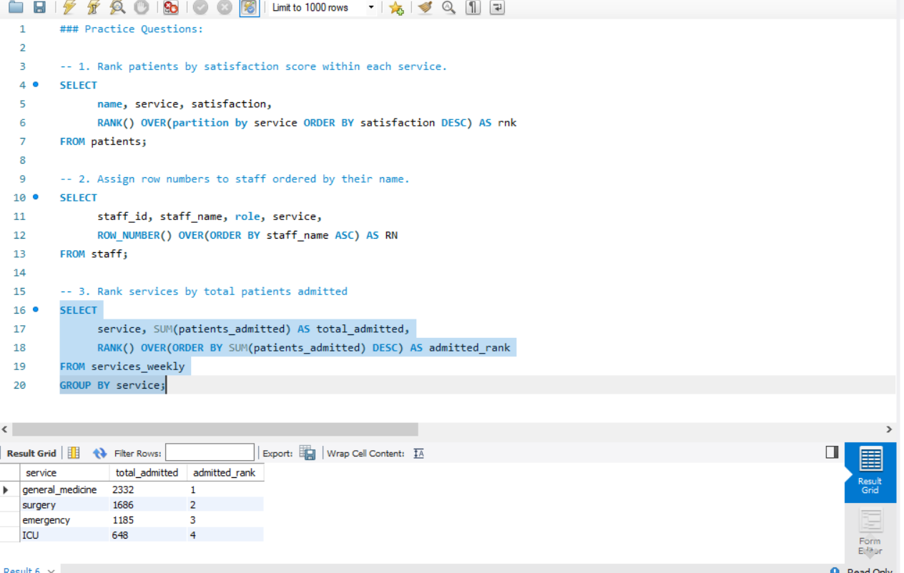
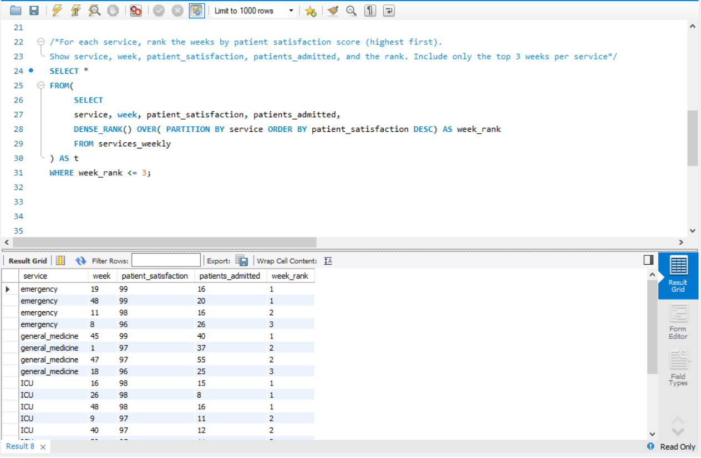

# 📅 Day 19 : Window Functions – ROW_NUMBER, RANK, DENSE_RANK  

**📚 Topics Covered:**  
ROW_NUMBER(), RANK(), DENSE_RANK(), OVER clause  

**🗂 Database:** **hospital**

---

## 📝 Practice Questions  

1. Rank patients by satisfaction score within each service.  
2. Assign row numbers to staff ordered by their name.  
3. Rank services by total patients admitted.  

### 🖼 Practice Questions Screenshot  

---

## ⭐ Daily Challenge  

**🔍 Question:**  
For each service, rank the weeks by patient satisfaction score (**highest first**).  
Show:  
- service  
- week  
- patient_satisfaction  
- patients_admitted  
- rank  

Include **only the top 3 weeks per service**.

### 🖼 Daily Challenge Screenshot  

---

