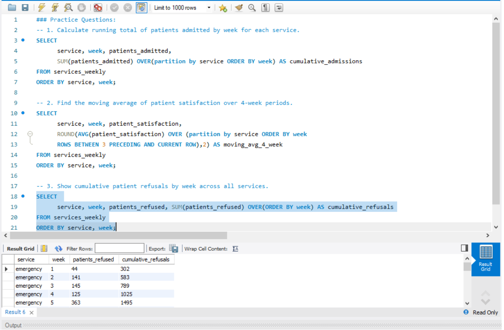
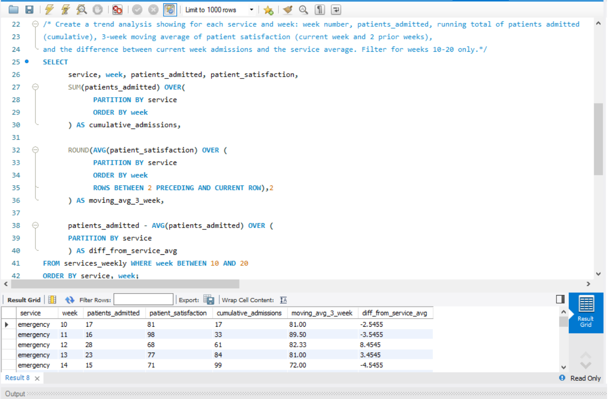

# 📅 Day 20 : Window Functions – Aggregate Window Functions

**📚 Topics Covered:**  
SUM() OVER, AVG() OVER, running totals, moving averages  

**🗂 Database:** **hospital**

---

## 📝 Practice Questions

1. Calculate running total of patients admitted by week for each service.  
2. Find the moving average of patient satisfaction over 4-week periods.  
3. Show cumulative patient refusals by week across all services.

### 🖼 Practice Questions Screenshot  

---

## ⭐ Daily Challenge

**🔍 Question:**  
Create a trend analysis showing for each service and week:

- week number  
- patients_admitted  
- running total of patients_admitted (cumulative)  
- 3-week moving average of patient satisfaction (current week + 2 prior weeks)  
- difference between current week admissions and the service average  

➡️ Filter for **weeks 10–20 only**.  
➡️ Order by **service, week**.

### 🖼 Daily Challenge Screenshot  

---
