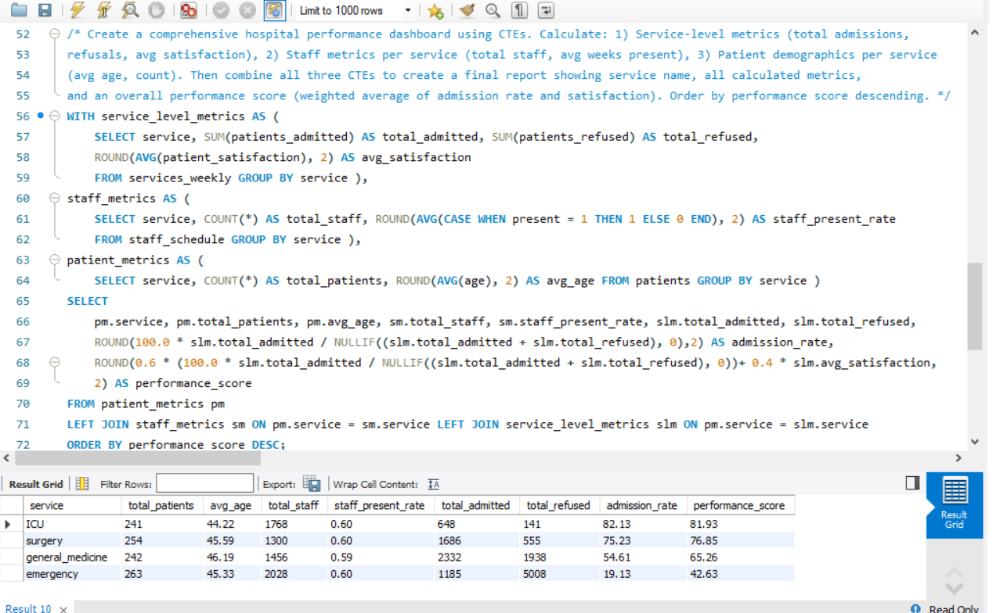

# 📅 Day 21 : Common Table Expressions (CTEs)

**📚 Topics Covered:**  
WITH clause, CTEs, recursive CTEs (if applicable), query organization

**🗂 Database:** **hospital**

---

## 📝 Practice Questions

1. Create a CTE to calculate service statistics, then query from it.  
2. Use multiple CTEs to break down a complex query into logical steps.  
3. Build a CTE for staff utilization and join it with patient data.

### 🖼 Practice Questions Screenshots  
.png)  
.png)  
.png)

---

## ⭐ Daily Challenge

**🔍 Question:**  
Create a comprehensive **hospital performance dashboard** using CTEs. Calculate:

### 📌 1. Service-level metrics  
- total admissions  
- total refusals  
- avg patient satisfaction  

### 📌 2. Staff metrics per service  
- total staff  
- avg weeks present  

### 📌 3. Patient demographics per service  
- avg patient age  
- patient count  

---

Combine all three CTEs into a final report showing:

- service name  
- all calculated metrics  
- **overall performance score** (weighted average of admission rate + satisfaction)

➡️ Order by **performance score descending**.

### 🖼 Daily Challenge Screenshot  

---
