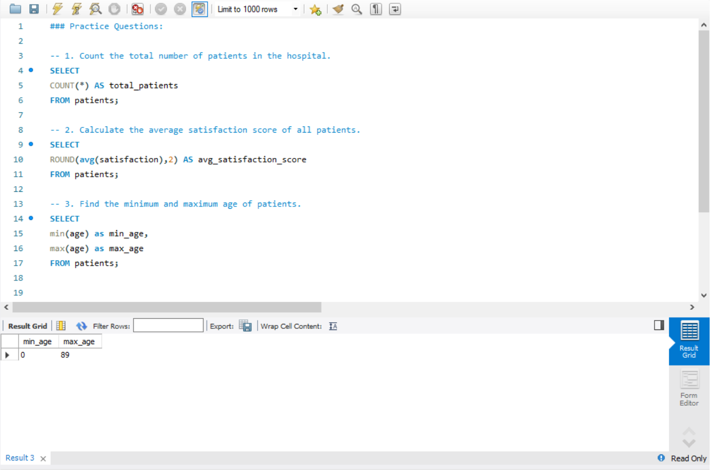
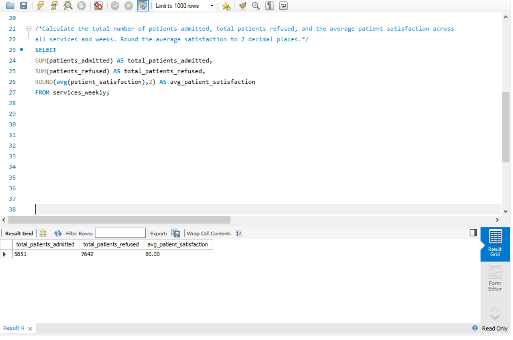

### Day 5: Aggregate Functions (COUNT, SUM, AVG, MIN, MAX)

**Database:** hospital  
**Topics:** COUNT, SUM, AVG, MIN, MAX functions  

### Practice Questions:
1. Count the total number of patients in the hospital.  
2. Calculate the average satisfaction score of all patients.  
3. Find the minimum and maximum age of patients.  

### Daily Challenge:
**Question:** Calculate the total number of patients admitted, total patients refused, and the average patient satisfaction across all services and weeks. Round the average satisfaction to 2 decimal places.

### Screenshots:
- **Practice Questions Output:** 
- **Challenge Output:** 
