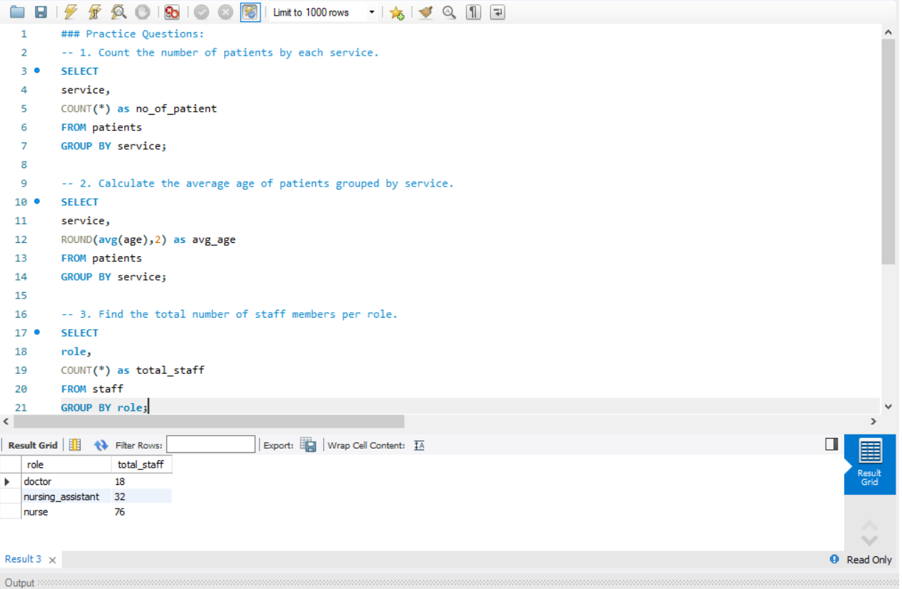
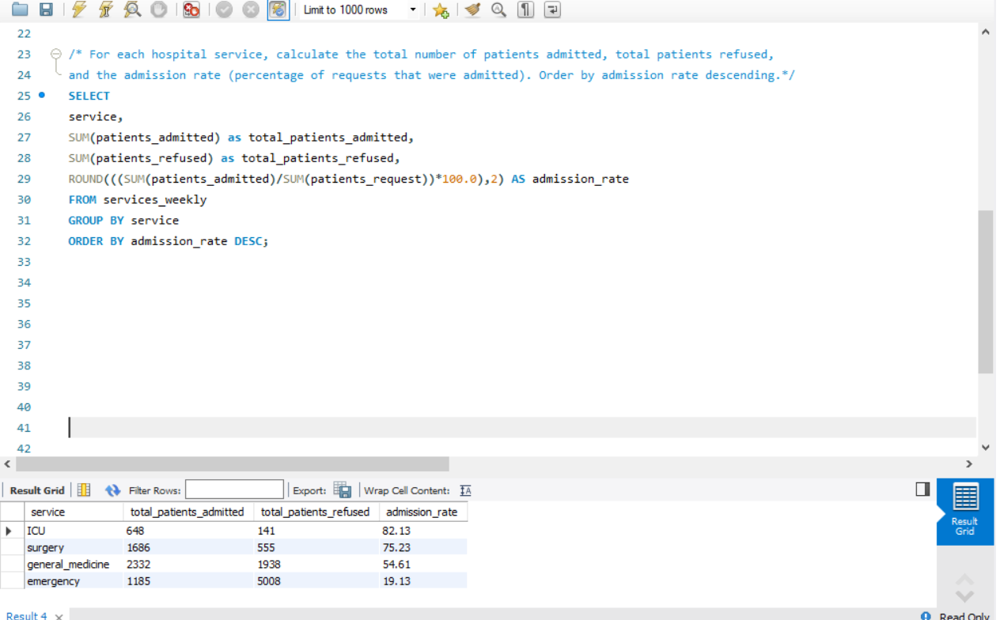

### Day 6: GROUP BY Clause

**Database:** hospital  
**Topics:** GROUP BY, aggregating by categories  

### Practice Questions:
1. Count the number of patients by each service.  
2. Calculate the average age of patients grouped by service.  
3. Find the total number of staff members per role.  

### Daily Challenge:
**Question:** For each hospital service, calculate the total number of patients admitted, total patients refused, and the admission rate (percentage of requests that were admitted). Order by admission rate descending.  

### Screenshots:
- **Practice Questions Output:** 
- **Challenge Output:** 
