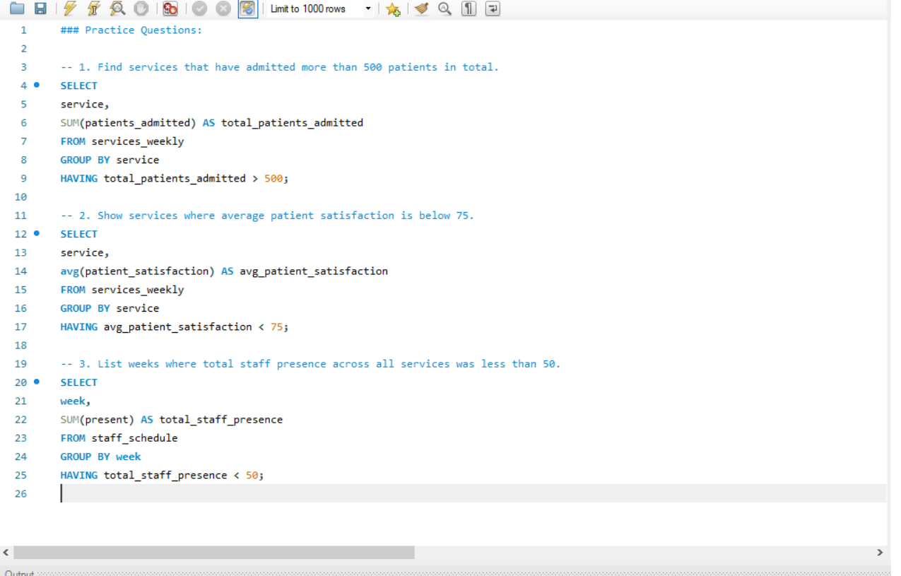
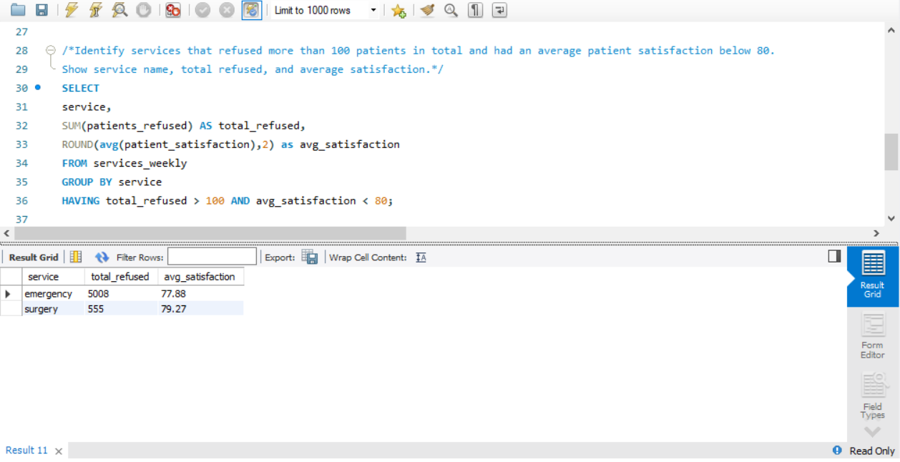

### Day 7: HAVING Clause

**Database:** hospital  
**Topics:** HAVING clause, filtering aggregated results  

### Practice Questions:
1. Find services that have admitted more than 500 patients in total.  
2. Show services where average patient satisfaction is below 75.  
3. List weeks where total staff presence across all services was less than 50.  

### Daily Challenge:
**Question:** Identify services that refused more than 100 patients in total and had an average patient satisfaction below 80. Show service name, total refused, and average satisfaction.  

### Screenshots:
- **Practice Questions:** 
- **Challenge Question:** 

