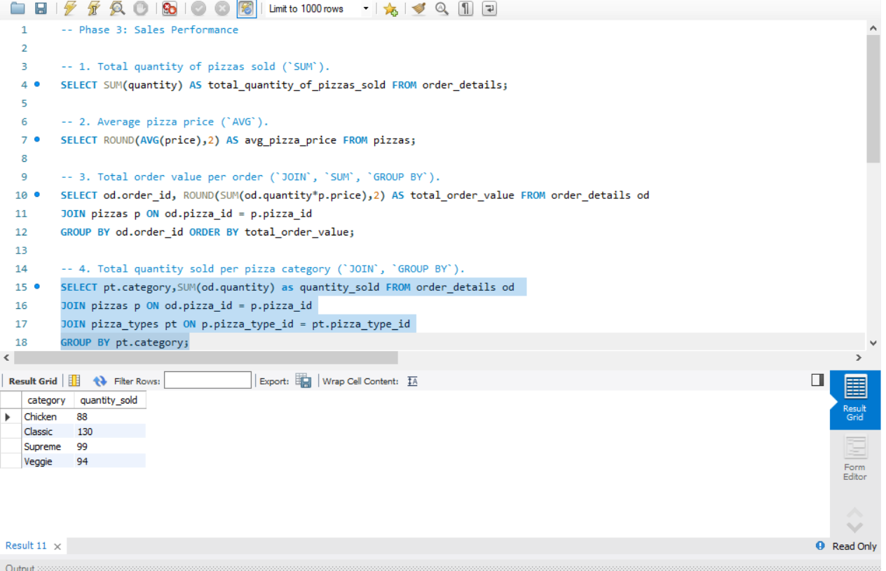
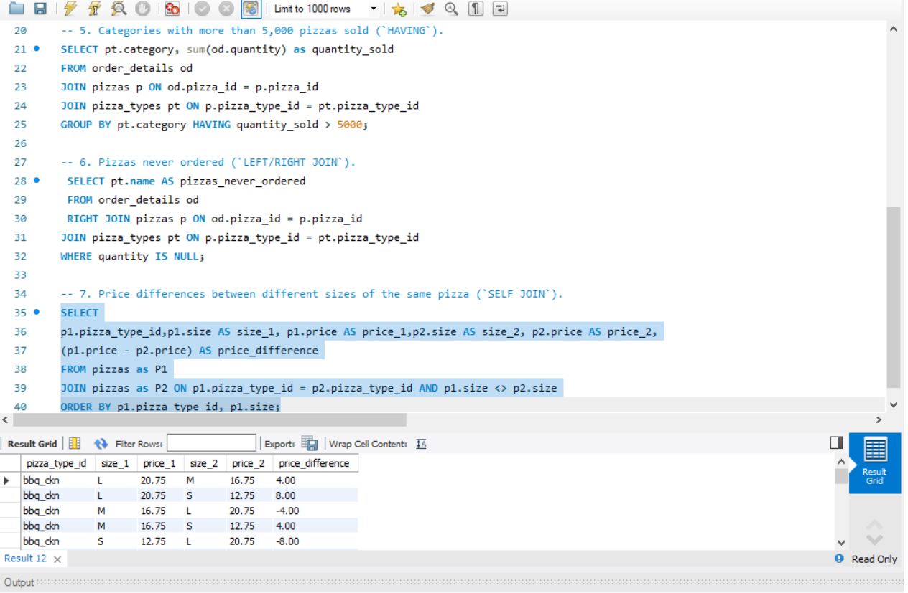

# 🍕 Mini Project – The Great Pizza Analytics Challenge  

Welcome to the **Great Pizza Analytics Challenge!**  
In this project, I analyzed real pizza sales data from **IDC Pizza** using SQL.

This mini-project covers everything from basic filtering to advanced joins and multi-table reporting.

---

## 📂 **Project Datasets**
The following CSV files are used in this project:

- **pizzas.csv**  
- **pizza_types.csv**  
- **orders.csv**  
- **order_details.csv**

---

## 🧠 **Skills Practiced**
- Database creation & table design  
- Filtering & operators (`WHERE`, `IN`, `BETWEEN`, `LIKE`)  
- Aggregations (`SUM`, `COUNT`, `AVG`, `GROUP BY`, `HAVING`)  
- Joins (`INNER`, `LEFT`, `RIGHT`, `FULL`, `SELF JOIN`)  
- DISTINCT, NULL handling, `COALESCE`  
- Multi-table relationship understanding  

---

# 📘 **Questions**

## **Phase 1: Foundation & Inspection**
1. Install `IDC_Pizza.dump` as IDC_Pizza server.  
2. List all unique pizza categories (`DISTINCT`).  
3. Display `pizza_type_id`, `name`, and ingredients, replacing NULL ingredients with `"Missing Data"`. Show first 5 rows.  
4. Check for pizzas missing a price (`IS NULL`).  

### 🖼 Screenshot – Phase 1  

---

## **Phase 2: Filtering & Exploration**
1. Orders placed on `'2015-01-01'`.  
2. List pizzas with `price` descending.  
3. Pizzas sold in sizes `'L'` or `'XL'`.  
4. Pizzas priced between $15.00 and $17.00.  
5. Pizzas with `"Chicken"` in the name.  
6. Orders on `'2015-02-15'` or placed after 8 PM.  

### 🖼 Screenshot – Phase 2  

---

## **Phase 3: Sales Performance**  
1. Total quantity of pizzas sold.  
2. Average pizza price.  
3. Total order value per order.  
4. Total quantity sold per pizza category.  
5. Categories with more than 5,000 pizzas sold.  
6. Pizzas never ordered.  
7. Price differences between different sizes of the same pizza.  

### 🖼 Screenshot – Phase 3 (Part 1)  

### 🖼 Screenshot – Phase 3 (Part 2)  

---
# 🚀 **Final Notes**

This mini-project strengthened my skills in:

✔ SQL filtering  
✔ Joins  
✔ Aggregations  
✔ Handling NULL  
✔ Multi-table analysis  
✔ Real-world data problem solving  

