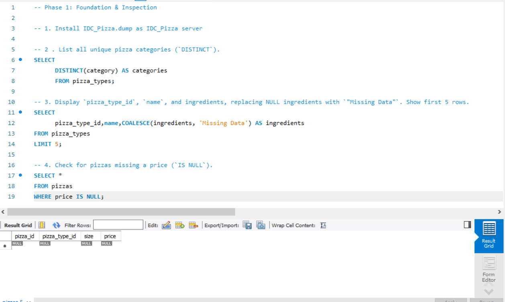
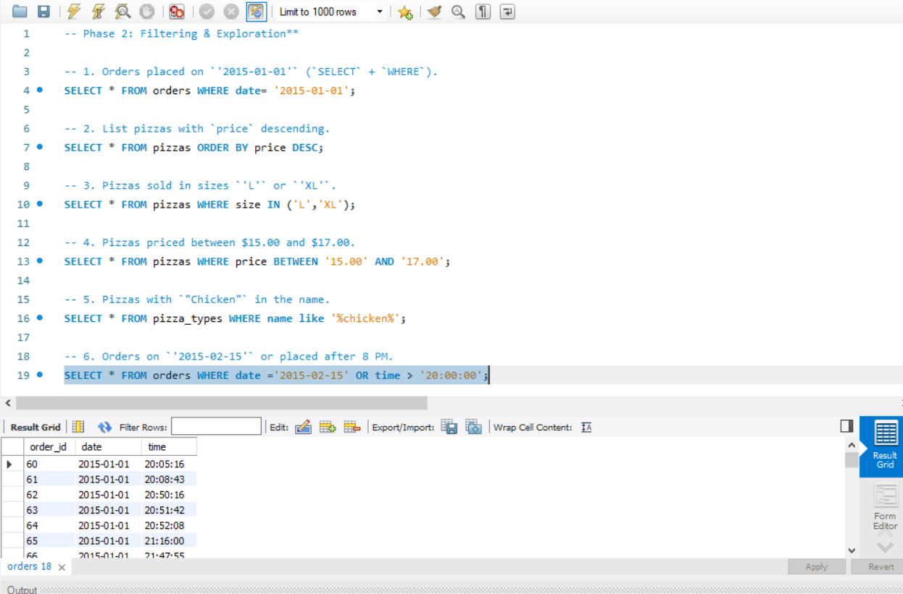

# 🍕 The Great Pizza Analytics Challenge  

Welcome to the **Great Pizza Analytics Challenge!**  
In this project, I analyzed real pizza sales data from **IDC Pizza** using SQL.

This mini-project covers everything from basic filtering to advanced joins and multi-table reporting.

---

## 📂 **Project Files Used**

- `pizzas.csv`  
- `pizza_types.csv`  
- `orders.csv`  
- `order_details.csv`

---

## 🧠 **Topics Practiced**

- Database creation & table design  
- Filtering (`WHERE`, `IN`, `BETWEEN`, `LIKE`, `AND/OR/NOT`)  
- Aggregations (`SUM`, `COUNT`, `AVG`, `GROUP BY`, `HAVING`)  
- Joins (`INNER`, `LEFT`, `RIGHT`, `FULL OUTER`, `SELF JOIN`)  
- NULL handling (`COALESCE`, `IS NULL`)  
- Multi-table reporting  

---

# 📝 **Challenge Questions**

The challenge was divided into **three phases**:

---

## 🔹 **Phase 1: Foundation & Inspection**

1. Install `IDC_Pizza.dump` as database  
2. List all unique pizza categories  
3. Display pizza details replacing NULL ingredients  
4. Find pizzas missing price  

🖼 **Screenshot – Phase 1 Queries**  

---

## 🔹 **Phase 2: Filtering & Exploration**

1. Orders on specific dates  
2. Pizzas sorted by price  
3. Pizzas in selected sizes  
4. Pizzas priced between values  
5. Pizzas with keyword in name  
6. Orders on date or after 8 PM  

🖼 **Screenshot – Phase 2 Queries**  

---

## 🔹 **Phase 3: Sales Performance**

### **Part 1**
1. Total quantity sold  
2. Average price  
3. Total order value per order  
4. Quantity by pizza category  

### **Part 2**
5. Categories with >5000 sales  
6. Pizzas never ordered  
7. Price differences in pizza sizes  

🖼 **Screenshot – Phase 3 (Part 1)**  

🖼 **Screenshot – Phase 3 (Part 2)**  

  
---

# 🚀 **Final Notes**

This mini-project strengthened my skills in:

✔ SQL filtering  
✔ Joins  
✔ Aggregations  
✔ Handling NULL  
✔ Multi-table analysis  
✔ Real-world data problem solving  

